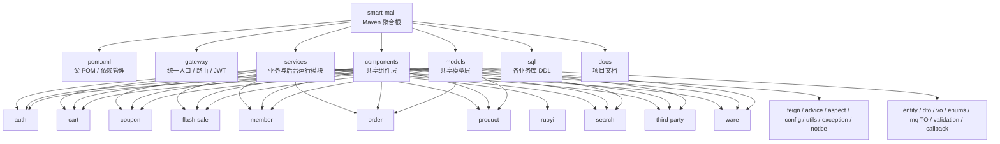
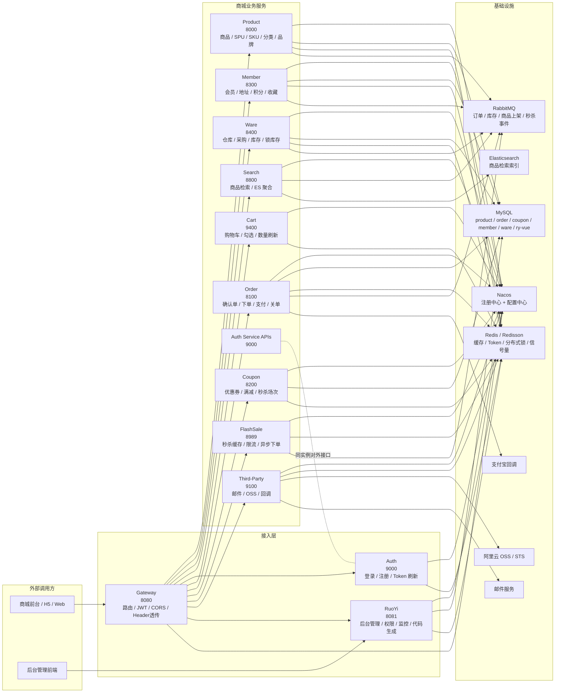
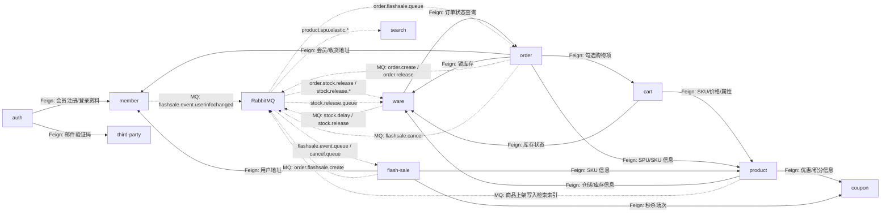
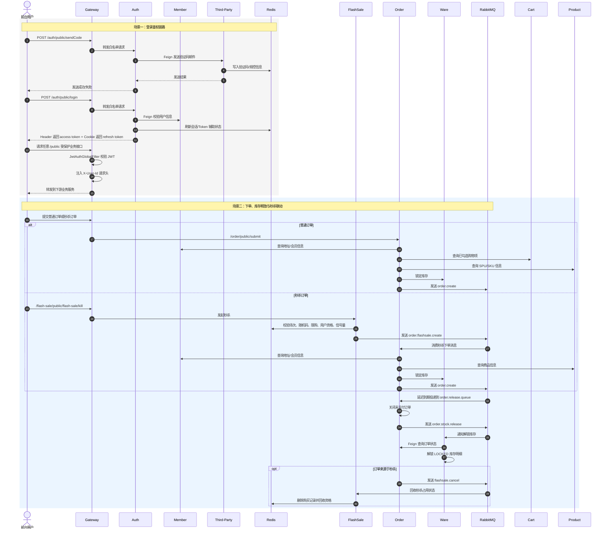

# 智慧商城仓库架构概览

## 概览

该仓库是一个基于 Spring Boot 3.3、Spring Cloud 2023 与 Spring Cloud Alibaba 2023 的 Maven 多模块后端项目。整体可分为 4 层：

- 聚合与共享层：`pom.xml`、`models`、`components`
- 接入层：`gateway`、`services/auth`、`services/ruoyi`
- 业务服务层：`product`、`coupon`、`ware`、`member`、`cart`、`order`、`search`、`flash-sale`、`third-party`
- 数据与基础设施层：MySQL、Redis/Redisson、RabbitMQ、Elasticsearch、Nacos、邮件、OSS、支付

其中：

- `models` 是编译期共享模型层，承载 entity、dto、vo、mq 消息体、校验与回调模型
- `components` 是编译期共享组件层，承载 Feign Client、全局异常、AOP、线程池、工具类与回调支持
- `gateway` 是统一业务入口，负责路由、CORS、JWT 校验与用户身份透传
- `ruoyi` 是仓内独立后台子系统，复用 Redis/Nacos，但不参与商城主链路的 Feign/MQ 编排

## 仓库结构图

说明：

- `services` 下当前有效运行单元共 11 个
- `components` 与 `models` 不是独立部署服务，而是业务模块的共享依赖
- `sql` 对应商品、订单、优惠、会员、仓储等业务库结构

## 运行时拓扑图

说明：

- `Gateway(8080)` 是统一商城入口，负责按路径前缀转发到各微服务
- `RuoYi(8081)` 是独立后台子系统，直接对接后台前端，不经过商城业务 Feign/MQ 编排
- `Search` 不依赖 MySQL，本地配置引入 `commons-elastic`
- `FlashSale` 强依赖 Redis/Redisson 与 RabbitMQ，用于秒杀活动缓存、用户资格控制、库存信号量和异步订单联动

## 服务通信图

说明：

- 实线表示同步调用，核心手段是 `components` 中统一定义的 OpenFeign Client
- 虚线表示异步事件，核心用于商品上架检索、订单延迟关单、库存释放、秒杀订单联动
- `search` 主要通过消费商品上架消息维护 ES 索引，而不是直接被其他业务服务调用写索引

## 关键时序图

说明：

- 登录链路的关键控制点在网关：白名单放行、JWT 校验、用户身份透传
- 普通订单与秒杀订单最终都归并到 `order` 和 `ware` 的统一订单/库存主链路
- `flash-sale` 自身不直接落订单库，而是通过 MQ 将秒杀订单创建事件委托给 `order`

## 服务清单表

| 服务 | 端口 | 主要职责 | 入口类型 | 主要中间件/配置 | 主要上游 | 主要下游 |
| --- | --- | --- | --- | --- | --- | --- |
| `gateway` | `8080` | 统一入口、路由转发、JWT 校验、Header 透传、CORS | Gateway Route + GlobalFilter | Nacos `sentinel`、Spring Security、JWT | 商城前台 | `product/member/ware/search/auth/cart/order/coupon/flash-sale/third-party/ruoyi` |
| `auth` | `9000` | 登录、注册、验证码、Token 刷新/登出 | `web` | Nacos `commons-mysql/commons-redis/commons-redis-cache/commons/oauth2/jwt/sentinel`、Spring Security、Spring Session Redis | Gateway | `member`、`third-party`、Redis |
| `product` | `8000` | 商品、分类、品牌、SPU/SKU、商品详情 | `controller` + `web` | Nacos `commons-mysql/commons-redis/commons-redis-cache/commons-callback/commons/rabbit/sentinel`、Redis、RabbitMQ | Gateway、`cart`、`order`、`flash-sale` | `coupon`、`ware`、RabbitMQ(`search`) |
| `coupon` | `8200` | 优惠券、满减、会员价、秒杀场次/关系 | `controller` | Nacos `commons-mysql/commons-redis/commons-redis-cache/commons/sentinel`、Redis | `product`、`flash-sale`、Gateway | MySQL、Redis |
| `member` | `8300` | 会员、地址、积分、成长值、收藏 | `controller` | Nacos `commons-mysql/commons-redis/commons-redis-cache/commons/sentinel`、Redis、RabbitMQ | `auth`、`order`、`flash-sale`、Gateway | RabbitMQ(`flash-sale`) |
| `ware` | `8400` | 仓库、采购、库存查询、锁库存、解锁库存 | `controller` | Nacos `commons-mysql/commons-redis/commons-redis-cache/commons/rabbit/sentinel`、Redis、RabbitMQ | `product`、`cart`、`order`、Gateway | `order`、RabbitMQ |
| `search` | `8800` | 商品搜索、条件过滤、ES 聚合查询 | `controller` + `web` | Nacos `commons/commons-elastic/rabbit/sentinel`、Elasticsearch、RabbitMQ | Gateway、RabbitMQ(`product`) | Elasticsearch |
| `flash-sale` | `8989` | 秒杀场次缓存、资格控制、随机码、信号量、异步秒杀下单 | `web` | Nacos `commons-redis/commons/rabbit/sentinel`、Redis、Redisson、RabbitMQ | Gateway、RabbitMQ(`member/order`) | `coupon`、`product`、`member`、RabbitMQ(`order`) |
| `third-party` | `9100` | 邮件验证码、OSS 上传签名、文件回调 | `controller` | Nacos `commons-redis/commons/commons-mail/commons-file/commons-callback/sentinel`、Redis、邮件、OSS | `auth`、Gateway、`product` | 外部邮件、阿里云 OSS |
| `cart` | `9400` | 购物车查询、增删改、勾选、刷新库存价格 | `controller` + `web` | Nacos `commons-mysql/commons-redis/commons-redis-cache/commons/cart/sentinel`、Redis | Gateway、`order` | `product`、`ware` |
| `order` | `8100` | 确认单、提交订单、支付回调、订单关闭、库存释放协同 | `controller` + `web` | Nacos `commons-mysql/commons-redis/commons-redis-cache/commons-feign/commons/rabbit/alipay/sentinel`、Redis、RabbitMQ、支付回调 | Gateway、RabbitMQ(`flash-sale`) | `cart`、`member`、`product`、`ware`、RabbitMQ |
| `ruoyi` | `8081` | 后台用户、角色、菜单、监控、定时任务、代码生成 | RuoYi Controllers | Nacos `commons-redis`、Spring Security、Redis、独立 `application.yml`/`application-druid.yml` | 后台前端 | MySQL、Redis |

## 说明与已知命名差异

### 1. `file` 与 `third-party` 的历史命名并存

- 共享 Feign 客户端 `components.feign.file.OSSFeignClient` 仍然使用 `@FeignClient("file")`
- 但当前仓库实际提供 OSS/邮件能力的运行服务是 `services/third-party`
- 网关也声明了 `id: file`，并将 `/file/**` 流量路由到 `lb://third-party`

这说明仓库中仍残留“文件服务独立部署”时期的命名，运行时语义已经收敛到 `third-party`

### 2. 网关 `/file/**` 路由与 RewritePath 写法不完全对称

- 当前网关谓词是 `/file/**`
- 但对应过滤器写的是 `RewritePath=/third-party/?(?<segment>.*), /${segment}`

文档中的运行时拓扑按“配置声明意图”建模为 `/file/** -> third-party`。若后续联调出现文件上传路径问题，应优先复核这条 RewritePath 配置

### 3. `ruoyi` 不属于商城主业务编排链

- `ruoyi` 虽然与商城服务处于同一聚合仓库
- 但它采用自身的控制器、配置和安全体系
- 它不参与当前商城业务的 Feign 互调主链，也不消费订单、库存、秒杀相关消息

### 4. `models` 与 `components` 是“共享层”而不是“平台服务”

- 架构图中单独绘制这两层，是为了表达代码复用关系
- 它们不会在运行时以独立进程启动
